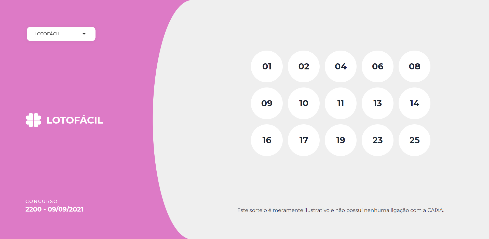

<p align="center">
  <a href="https://github.com/lorenatoscano/projeto-loterias/blob/main/README-en.md">English</a>&nbsp;&nbsp;&nbsp;•&nbsp;&nbsp;
  <a href="https://github.com/lorenatoscano/projeto-loterias/blob/main/README.md">Português (Brasil)</a>
</p>
<hr>

<p align="center">
  <a href="#sobre">Sobre</a>&nbsp;&nbsp;&nbsp;|&nbsp;&nbsp;&nbsp;
  <a href="#tecnologias-utilizadas">Tecnologias utilizadas</a>&nbsp;&nbsp;&nbsp;|&nbsp;&nbsp;&nbsp;
  <a href="#como-rodar">Como rodar?</a>&nbsp;&nbsp;&nbsp;|&nbsp;&nbsp;&nbsp;
  <a href="#to-do">To do</a>&nbsp;&nbsp;&nbsp;|&nbsp;&nbsp;&nbsp;
  <a href="#licença-e-autora">Licença e Autora</a>
</p>

## Sobre
Projeto web front-end em React que mostra os resultados das loterias, desenvolvido para a disciplina de Frameworks Javascript do BTI.

A tarefa era criar uma aplicação SPA (Single Page Application) que possuísse diferentes componentes que se comuniquem entre si (entre pai-filho e/ou compartilhando dados), com rotas diferentes e consumindo serviços web (ex: API REST).

Fiz o projeto com base nas instruções desse [exercício de front-end da Brainn](https://github.com/brainnco-exs/readme-frontend). A [API](https://brainn-api-loterias.herokuapp.com/) e o [protótipo de layout](https://www.figma.com/file/H2qrYBCFMf4didYmxRwTxP/Brainn-Frontend-Challenge) deles foram muito úteis.

### Acesse a demo da aplicação em funcionamento:
https://loterias.vercel.app/
<p align="center">
  
</p>


## Tecnologias utilizadas
- [ReactJS](https://reactjs.org/) com [Typescript](https://www.typescriptlang.org/)
- [React Router DOM](https://reactrouter.com/web/) para criação de rotas
- [Sass](https://sass-lang.com/) para estilização
- [daisyUI](https://daisyui.com/) para alguns estilos pontuais de componentes
- [Axios](https://axios-http.com/ptbr/docs/intro) para fazer as requisições a API.


##  Como rodar?
Execute os comandos no seu terminal:

```bash
# Clone o repositório
$ git clone https://github.com/lorenatoscano/projeto-loterias.git

# Entre no repositório
$ cd projeto-loterias

# Instale as dependências
$ yarn install

# Execute a aplicação
$ yarn start
```

Acesse em seu navegador http://localhost:3000/ para ver o resultado.

## To do
Algumas ideias para melhorar a aplicação que pretendo fazer no futuro:
- Adicionar responsividade para telas mobile.
- Adicionar um indicador de "loading" enquanto as requisições são efetuadas e o conteúdo é carregado.
- Consumir dados de sorteios reais das loterias CAIXA.
## Licença e Autora
Este projeto está sob a licença MIT. Veja o arquivo [LICENSE](https://github.com/lorenatoscano/projeto-loterias/blob/main/LICENSE) para mais detalhes.

Feito por [Luiza Lorena Toscano de Medeiros](https://github.com/lorenatoscano).


[](https://www.linkedin.com/in/lorena-toscano-243432183/)